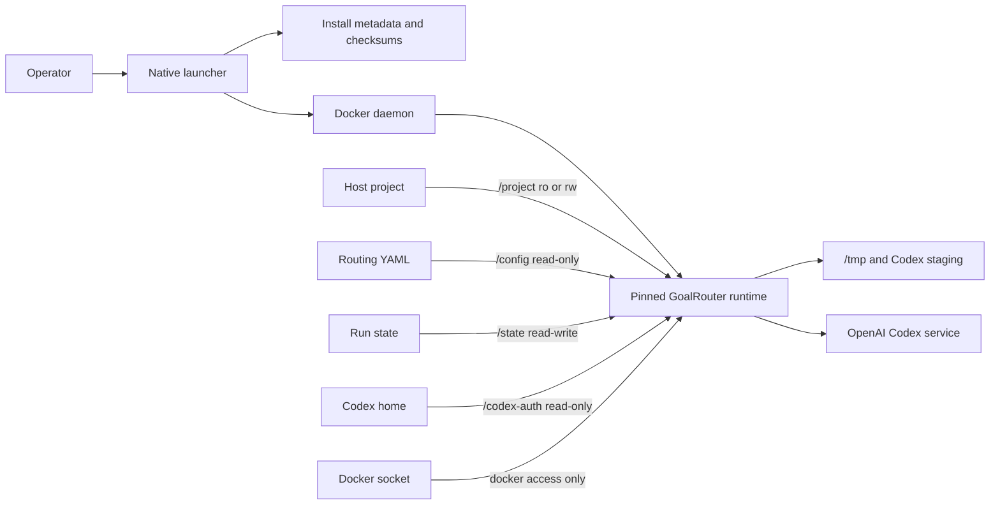
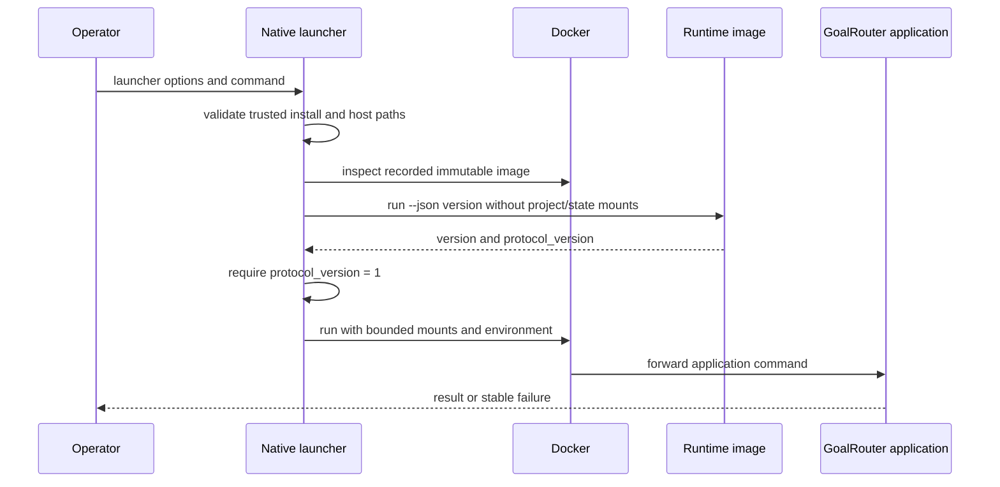
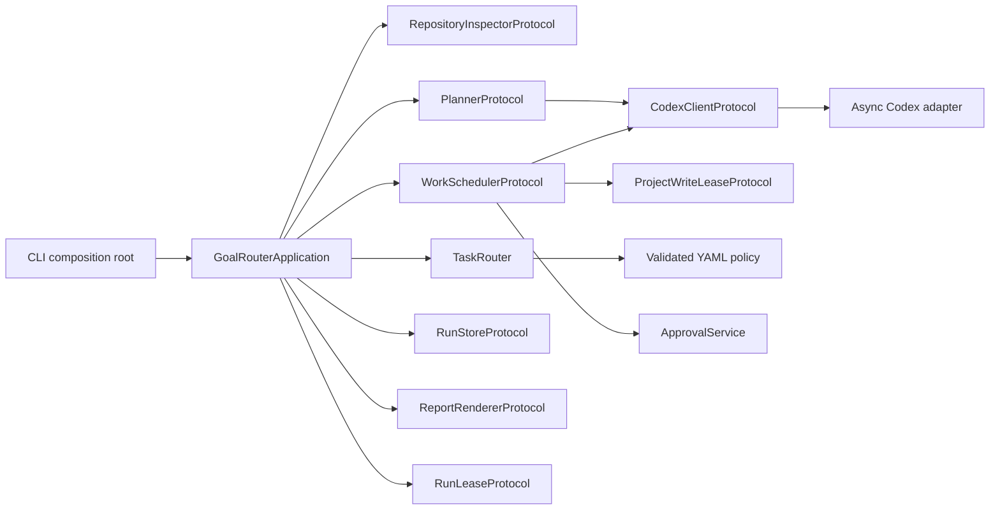
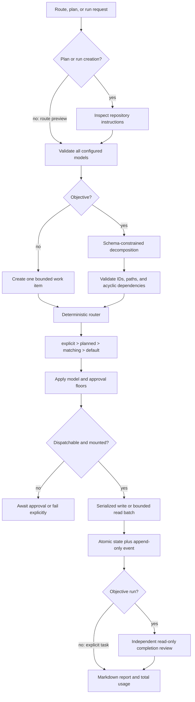
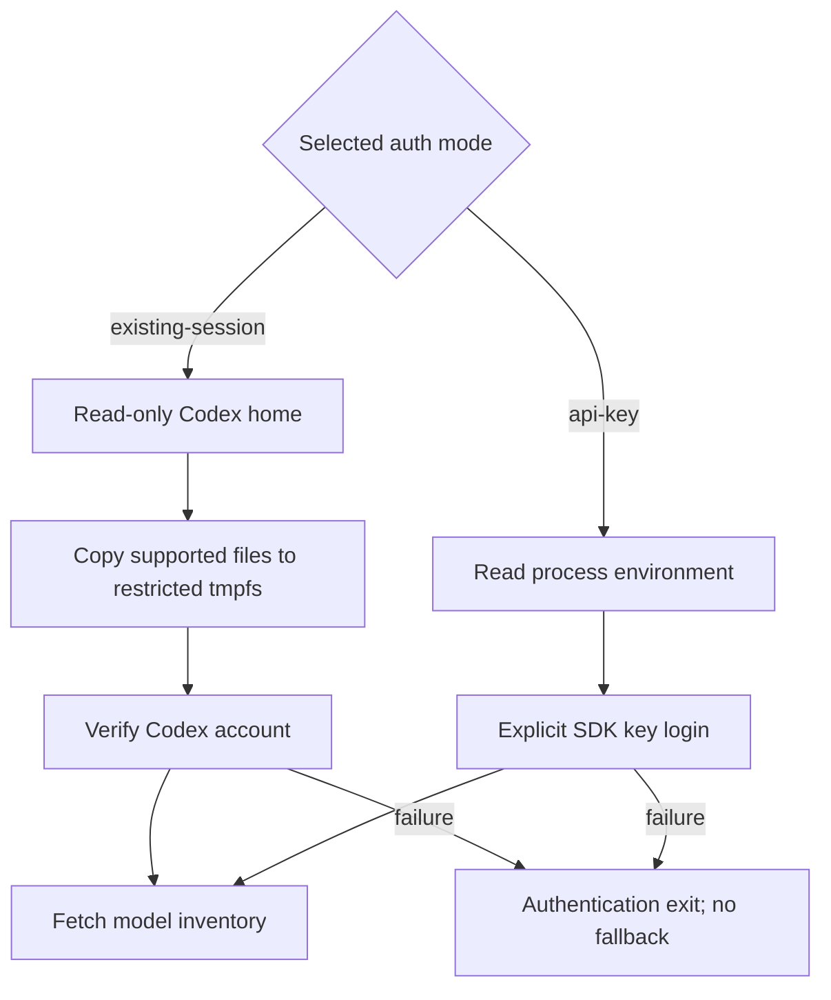
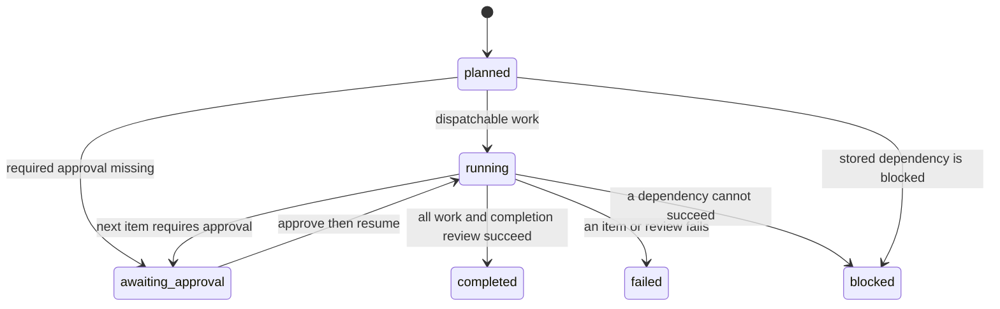

<!-- SPDX-License-Identifier: MIT -->
<!-- File: docs/architecture.md -->
<!-- Purpose: GoalRouter launcher, runtime, routing, execution, and state architecture -->

# Architecture

GoalRouter separates a small host-native launcher from a pinned Python 3.14 application
image. The launcher owns host path resolution, installed trust metadata, image selection,
mount authority, and protocol negotiation. The containerized application owns
configuration, Codex authentication, repository evidence, routing, execution, approval,
state, and reporting.

## Runtime topology

The image root is read-only, declares UID/GID 10001 in its runtime metadata, and uses
tmpfs for ephemeral writes. The POSIX launcher overrides that identity with the invoking
UID/GID; root invocation runs the container as root. Do not install or invoke GoalRouter as
root. The Windows launcher retains the configured image identity, resolves local drive
paths, converts them through the recorded WSL distribution, and routes Docker through
WSL. It never runs the Python application in WSL or on Windows.

## Launcher/container protocol

Launcher protocol major version 1 uses this sequence:

Protocol preflight happens before project, state, authentication, or Docker-socket mounts.
A major mismatch fails as `launcher_protocol_mismatch` without initializing the SDK or
mutating state. POSIX installed mode rejects a foreign `--image` override and uses the
exact repository digest recorded by the verified installer. Windows ordinary installed
runs accept a syntactically valid explicit `--image` without changing the trusted install
record; the override does not change trusted installation metadata. That reduced-trust
path gives the selected image the run's authorized mounts and environment and therefore
requires independent trust in the image. Windows maintenance, update, and doctor paths
remain trusted digest only.

## Authority matrix

| Layer | `readonly` | `write` | `docker` |
|---|---|---|---|
| Project bind | read-only | read-write | read-write |
| Config bind | read-only | read-only | read-only |
| State bind | read-write | read-write | read-write |
| Codex source bind | read-only | read-only | read-only |
| Runtime root | read-only | read-only | read-only |
| Docker socket | absent | absent | read-write |
| Permitted task sandbox | read-only | read-only or workspace-write | read-only or workspace-write |

Authority is the intersection of launcher access, route sandbox, and approval state. The
Docker socket is not a general feature flag; it is a separate high-authority capability.

## Application components

Stable domain values are frozen, slotted dataclasses. Cross-module I/O ports are structural
Protocols injected at the CLI composition root. Only `src/goalrouter/sdk` imports the
OpenAI Codex SDK. Public application boundaries are async; owned sibling reads use
`asyncio.TaskGroup`, timeout scopes use `asyncio.timeout`, and blocking filesystem calls
are isolated with `asyncio.to_thread`.

## Repository instruction trust

Repository instruction discovery is descriptor-rooted beneath the resolved project and
uses no-follow semantics for every path component and final file. GoalRouter opens the
project root and each instruction component relative to already-open directory
descriptors. It opens `AGENTS.md` and root `SKILLS.md` nonblocking, verifies the opened
object is a regular file, and decodes content only from that descriptor. Missing
instruction files remain optional; symbolic links, unsafe ancestors, directories, FIFOs,
devices, sockets, invalid UTF-8, and other unsafe reads fail repository inspection.

For plan and run creation, repository inspection and unsafe-instruction rejection precede
model inventory. Rejected content therefore cannot become planner context, SDK developer
instructions, run state, or report output in those workflows. Route previews and the
standalone model inventory do not consume repository instructions. Accepted regular-file
content remains untrusted repository input and is supplied only within the configured task
authority.

Repository Git inspection begins only after descriptor-rooted instruction preflight
succeeds. It executes absolute `/usr/bin/git` with an explicit minimal environment,
disables Git filesystem monitors and Git hooks at command scope, and pins the validated
worktree, Git directory, and index identity around evidence reads. Global and system
configuration sources, Git environment redirection, lazy object fetching, replacement
objects, user protocols, pagers, prompts, and dynamic-loader injection are not inherited by
the child process. One exact lexical worktree path is trusted at command scope for Docker
bind-mount ownership compatibility; a wildcard or different discovered root is never trusted.

Dirty-path evidence is composed from strict NUL-delimited `ls-files --stage -t`, `ls-tree`,
and `ls-files --others --exclude-standard` metadata. Git does not perform tracked-file
conversion or receive tracked worktree file content for comparison. GoalRouter instead opens
each indexed regular file or symbolic link below the pinned root with no-follow semantics,
rejects unsafe types and races, and computes the raw Git blob identifier itself. Regular-file
hashing runs in a GoalRouter-owned isolated helper that inherits only the already-open file
descriptor; timeout or cancellation kills and reaps its process group. Raw comparison can
conservatively report files as dirty when their index identity depends on end-of-line
normalization or a custom clean/process filter. No optional index lock is taken and no target
file is written.

The lexical `.git` entry may be a normal directory or a regular linked-worktree gitfile.
Linked worktrees are supported after their discovered worktree and Git-directory paths
validate. Unsafe lexical `.git` entry types fail before Git starts; malformed gitfiles or
discovery evidence fail during the single hardened discovery command and before branch,
dirty-evidence, planner, or model work. The external administrative directory named by a valid
linked worktree remains Git metadata, not project content; GoalRouter reads it only through
the hardened Git boundary and never deletes or repairs it.

## Request and routing flow

The planner selects configured task IDs and planner-requested access, but not concrete
models or authority. Planner-requested access classifies work for concurrent reader
batches and writer serialization. It cannot grant launcher mounts and cannot grant
sandbox authority; effective capability still comes from the launcher profile, routed
sandbox, and approval state. The router resolves model alias, concrete model, reasoning
effort, sandbox, approval, timeout, attempts, escalation, match reason, and hard-risk
floors. Missing models and unknown tasks fail; there is no downgrade or compatibility
fallback.

The scheduler runs at most one write-capable item per physical target project. It takes a
nonblocking kernel lease on the opened project directory before approval revalidation and
dispatch, then retains ownership through state and terminal-event persistence. The lease
creates no file in the target. Ready readers do not take this project lease and may run
together up to `maximum-read-concurrency`. A sibling exception cancels the owned read batch
and records failures. Failed dependencies block dependents. Every terminal result is saved
before the next batch. Completion review applies only to objective runs: after objective
work succeeds, a separate configured, read-only completion item must succeed before the
run is complete. An explicit task run completes from its own terminal result and does not
append that item.

## Authentication flow

Session staging copies only `auth.json`, `config.toml`, and `models_cache.json` when they
exist. The source bind is never writable. API-key mode is explicit and environment-only.

## State model

Each run ID maps to a directory beneath the configured state root:

- `state.json` — current schema-versioned run snapshot, written by temporary file plus
  atomic replacement;
- `events.jsonl` — append-only event records flushed and synchronized per line;
- `report.md` — current deterministic human-readable report, atomically replaced.

Store operations retain their in-process async serialization. In addition, every mutating
run workflow takes a nonblocking kernel lease on a stable mode-`0600` file beneath the
selected state root at `.locks/runs/RUN_ID.lock`. Planning, task/objective execution,
approval, resume, and report hold that lease from before create/load through their final
write. The lockfile is retained so all processes address the same inode; kernel ownership
ends on normal exit or process death. `status` only atomically loads the latest persisted
snapshot, does not mutate it, and does not acquire the run lease.

Run IDs accept only a bounded safe character set. State contains repository evidence, work
items, routes, results, approvals, configuration digest, and status. Known secret fields
and values are redacted before persistence.

Resume refuses configuration digest drift unless explicitly acknowledged. Acknowledgement
reroutes unfinished work and clears approvals; terminal results remain. An interrupted item
with a stored Codex thread ID resumes that thread.
