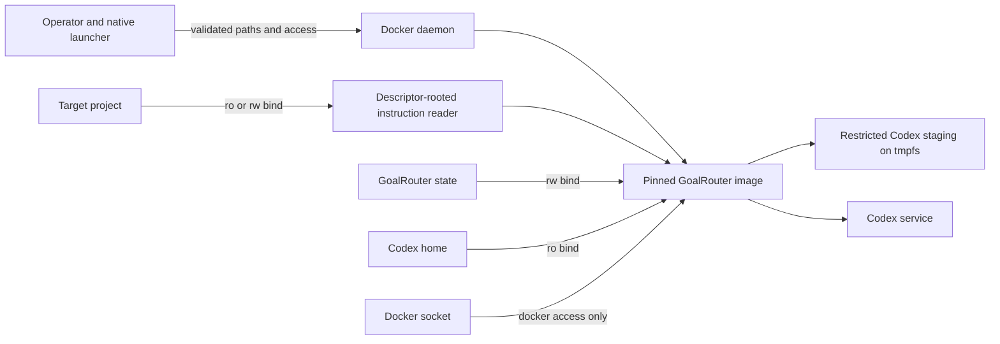

<!-- SPDX-License-Identifier: MIT -->
<!-- File: docs/security.md -->
<!-- Purpose: GoalRouter runtime trust, credential, authority, and approval model -->

# Security

GoalRouter coordinates only authority represented by the native launcher mount, routed
sandbox, and current fingerprint-bound approval. It does not independently initialize or
clean source control, publish a release, mutate credentials, or infer external authority
from a broad objective.

## Trust boundaries

The installed launcher validates its ownership records, checksums, physical file layout,
recorded image reference and digest, and launcher/runtime protocol before executing work.
Host paths must resolve to safe local filesystem objects. The runtime root filesystem is
read-only and receives an executable temporary filesystem only for bounded runtime state.
The runtime image declares a non-root UID/GID, but the POSIX launcher maps the invoking
UID/GID into the container; root invocation runs the container as root. Do not install or
invoke GoalRouter as root.

## Authority profiles

| Launcher access | Project | State | Codex source | Docker socket | Appropriate use |
|---|---|---|---|---|---|
| `readonly` | read-only | read-write | read-only | absent | Inspection, routing, planning, status, report, read-only turns. |
| `write` | read-write | read-write | read-only | absent | Authorized workspace changes. |
| `docker` | read-write | read-write | read-only | read-write | Explicit daemon-invoking work only. |

The socket can control host containers and must be treated as high authority. It is never
present in `readonly` or `write`. State remains writable so work can checkpoint safely;
Codex source state remains read-only in every profile.

Route policy adds another boundary. Version 1 accepts only `read-only` or
`workspace-write` task sandboxes. A broader launcher mount cannot turn a read-only route
into write authority, and an approval does not add mount or socket capability.

## Authentication and secrets

Default `existing-session` mode stages `auth.json`, `config.toml`, and
`models_cache.json` from the read-only Codex mount into container tmpfs with restrictive
modes. Failure is fatal, with no silent key fallback. Explicit `api-key` mode accepts
`OPENAI_API_KEY` from the process environment only. Never store keys in YAML, state,
prompts, repository instructions, shell profiles, issue text, or reports.

State persistence recursively redacts known credential field names, `sk-` values, and
Bearer values. Redaction is defense in depth, not permission to pass secrets through work
items. Plan and run-creation workflows reject instruction symbolic links and non-regular
files before those workflows make a Codex SDK or model call. GoalRouter opens every
instruction component with no-follow semantics and reads content only after the opened
object is proven to be a regular file. It never reads the target of a rejected link. In
those workflows, rejection happens before model inventory, planning, worker dispatch, or
state creation. Route previews and standalone model inventory do not consume repository
instructions. Regular instruction content is still untrusted and is sent as developer
context for dispatched work, so inspect it before granting write access.

Repository-controlled local or included Git configuration cannot enable Git filesystem-monitor
or Git-hook execution during inspection. Inherited Git, pager, prompt, loader, and configuration
environment variables are not propagated. Each command also disables optional index locks,
global attributes and excludes files, submodule recursion, lazy fetching, replacement objects,
user protocols, and interactive prompts. The validated worktree, Git directory, and index are
pinned around inspection, and unusual filenames are consumed from strict NUL-delimited metadata
without shell interpretation.

GoalRouter does not use `git status`, diff commands, conversion-aware hashing, text-conversion,
or attribute queries for tracked-file comparison. Git supplies only index, HEAD-tree, and
untracked-name metadata. GoalRouter opens indexed paths beneath a pinned root descriptor with
no-follow/nonblocking flags, accepts only regular files and indexed symbolic links, checks
identity before and after each read, and hashes regular files in a killable helper process that
inherits only the open descriptor. Repository clean/process filters selected by worktree or
Git-directory attributes therefore cannot execute. Because comparison uses raw bytes rather
than Git conversion rules, end-of-line normalization and custom filters can produce a safe
false-dirty result.

Linked-worktree gitfiles are supported when Git returns valid absolute worktree and
administrative-directory paths matching the lexical project boundary. A `.git` symlink,
FIFO, device, malformed discovery result, ownership refusal, timeout, or oversized output
fails explicitly. GoalRouter adds one command-scoped safe-directory exception for the exact
lexical worktree candidate so read-only Docker mounts remain inspectable; it never trusts a
wildcard or a different discovered root. GoalRouter does not attempt to repair source-control
metadata.

## Execution ownership

Mutating commands take a nonblocking per-run kernel lease before creating or loading run
state. Write-capable work separately takes a nonblocking lease on the opened physical
project directory before approval revalidation or SDK dispatch. The project lease creates
no file or sentinel in the target worktree. Read-only work does not take the project-writer
lease, and `status` remains an unleased atomic snapshot.

Contention fails closed without waiting or polling: project writer contention exits `14`
and same-run mutation contention exits `15`. Project contention does not dispatch the
contending writer or create a failed work result; readers completed before that point
remain recorded. Run contention rejects the contending mutator before repository
inspection, model inventory, planner, SDK, or state work. Kernel descriptor ownership is
released on normal exit and process death, so retry is safe only after the owner has
exited.

## Approvals and risk floors

Approval-required work uses SHA-256 over canonical work-item JSON, route JSON, and the
configuration digest. A changed item, route, or config invalidates approval. Hard-risk
rules may increase model capability or require approval, and later routing cannot weaken
those floors. Destructive and external-write task flags activate their corresponding risk
rules.

Approval is narrow: it authorizes one current work item only. It does not authorize
unrelated file changes, source-control publication, secret mutation, release operations,
or cleanup outside the described paths.

## Target preservation

Repository inspection captures applicable `AGENTS.md`/`SKILLS.md`, language counts, Docker
files, branch, and dirty paths without executing target code. Work receives dirty-path
evidence and preservation instructions. GoalRouter never normalizes a dirty target by
cleaning or resetting it. Operators should compare target status before and after risky
work and retain unrelated changes.

Status does not take optional index locks and ignores nested submodule worktree dirtiness,
preventing inspection from entering a submodule and consuming its configuration. A staged
gitlink change in the parent remains parent-repository evidence. The index and target
worktree are not refreshed, locked, or rewritten by inspection.

## Supply chain and installation

Installers require HTTPS for canonical releases, verify checksums, validate canonical
manifest structure and bounded archive membership, reject unsafe path relationships, pin
the pulled image by repository digest, verify runtime version/protocol, and activate owned
files transactionally. Releases publish SBOM and maximum-provenance data for both native
architectures and attest the final multi-architecture image digest.

Build and smoke services also pin every Docker CLI helper image by an exact numeric version
and the official multi-architecture OCI index digest. Repository policy binds those
authorities to their actual consumers and rejects tag-only, changed-digest, relocated, or
additional references.

Report vulnerabilities privately through the process in [../SECURITY.md](../SECURITY.md).
